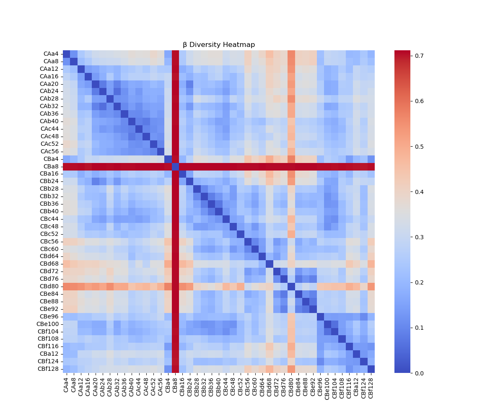

# null-model-microbiome-beta-diversity
Null model-based analysis of microbial community beta diversity to infer ecological processes.

# Null Model-Based Analysis of Microbiome Beta Diversity

This repository provides data and code for studying microbial beta diversity using null model approaches to understand underlying ecological processes.

## 🧬 Background

Beta diversity measures differences in microbial composition across samples. By applying null models, we can determine whether observed patterns deviate from random expectations and infer processes such as selection, dispersal, and ecological drift.

## 📁 Repository Structure

- `data/`: Raw and processed input data.
- `scripts/`: Python and R scripts for data processing and analysis.
- `results/`: Output files including beta diversity matrices and visualizations.
- `docs/`: Supporting documents and references.

## ⚙️ Requirements

- Python 3.8+
- R 4.1+
- Python packages: `pandas`, `scikit-bio`, `matplotlib`
- R packages: `vegan`, `phyloseq`, `picante`

## 🚀 Running the Analysis

```bash
python scripts/data_preprocessing.py
Rscript scripts/null_model_analysis.R
python scripts/beta_diversity_plot.py
```
## 📊 Methods
- Beta diversity metrics: Bray-Curtis, Jaccard, UniFrac
- Null model: Raup-Crick (RC_bray, RC_unifrac)
- Statistical testing: PERMANOVA, Mantel test
- Visualization: NMDS, PCoA

## 📚 References
- Chase JM, Kraft NJB, Smith KG, Vellend M, Inouye BD. (2011). Using null models to disentangle variation in community dissimilarity from variation in alpha diversity.
- Stegen JC et al. (2013). Quantifying community assembly processes and identifying environmental drivers of microbial communities.
# Understanding Beta Diversity and Null Model Correction in Microbial Community Analysis

## What is Beta Diversity?

**Beta diversity** quantifies the differences in species composition between ecological communities, reflecting spatial or environmental heterogeneity. In microbial ecology, beta diversity analysis is widely used to explore how **stochastic processes** (e.g., dispersal, ecological drift) and **deterministic processes** (e.g., environmental selection, niche differentiation) shape community structure. 

By applying **null model correction**, researchers can partition the contributions of random versus non-random processes to community variation, offering a clearer understanding of the underlying ecological mechanisms.

---

## 1. Core Concept

Environmental gradients (e.g., depth, temperature, pH) often have strong effects on beta diversity by influencing species abundance and distribution. However, such effects may **mask the influence of stochastic processes**. 

The core idea of **null model correction** is to simulate randomized expectations by removing or controlling environmental effects, thus allowing us to:
- Isolate and quantify the effect of stochasticity.
- Accurately attribute observed beta diversity to either environment-driven or neutral processes.

---

## 2. Analysis Workflow

### Step 1: Data Preparation
- **Input data**: Species abundance matrix (e.g., OTU or ASV table) and sample-associated environmental variables.
- **Beta diversity metric selection**:
  - *Presence/absence-based*: Jaccard, Sørensen.
  - *Abundance-weighted*: Bray-Curtis, weighted UniFrac.

### Step 2: Constructing the Null Model

1. **Define randomization constraints**:
   - *Fix total abundance per sample*: Randomly redistribute species while keeping sample totals constant.
   - *Fix species abundance distribution*: Maintain species frequencies while reshuffling across samples.
   - *Environmental constraints*: Introduce environmental structure into randomizations to simulate deterministic-only influence.

2. **Generate null distributions**:
   - Perform hundreds or thousands of randomizations to build a baseline distribution of expected beta diversity under the null hypothesis.

### Step 3: Calculate Beta Diversity

- **Observed value**: Compute beta diversity using original community data.
- **Null values**: Recalculate beta diversity for each randomized dataset to construct a null distribution.

### Step 4: Compare Observed vs. Null Distribution

- **Standardized Effect Size (SES)** is computed as:


- **Interpretation of SES**:
- `SES > 2`: Strong deterministic (environmental selection) influence.
- `SES < -2`: Strong stochastic influence (e.g., drift or dispersal).
- `-2 ≤ SES ≤ 2`: Likely both processes are at play.

- **Statistical testing**:
- Perform one-sample t-tests or permutation tests to assess significance (p-values).

### Step 5: Partitioning Community Variation

- **Deterministic partitioning**:
- Use *Redundancy Analysis (RDA)* or *Distance-based RDA (db-RDA)* to quantify the amount of beta diversity explained by environmental variables.

- **Stochastic partitioning**:
- Unexplained residual variation is typically attributed to neutral or random processes (e.g., drift, dispersal limitation).

---

## 3. Output Interpretation

- **Standardized Effect Size (SES)**:
- >2: Environmental selection dominates.
- <-2: Stochastic processes dominate.
- Between -2 and 2: A mix of both.

- **PERMANOVA**:
- Provides p-values and the percentage of variation explained by environmental factors.

---

## 4. What Is a Null Model in Microbial Ecology?

In microbial ecology, a **null model** is a statistical framework used to determine whether observed community structures differ from random expectations. These models are especially useful in assessing whether **niche-based processes (e.g., competition)** or **neutral processes (e.g., drift)** drive microbial patterns.

### Common Null Model Strategies

1. **Randomization-based Models**
 - Shuffle abundance values while maintaining row/column sums.
 - Compare metrics (e.g., richness, diversity, turnover) against randomized distributions.

2. **Niche-based Models**
 - Incorporate environmental preferences or habitat filtering in randomization.
 - Reflect how species respond to gradients (e.g., temperature, depth).

3. **Neutral Models**
 - Assume all species have equal fitness.
 - Community assembly is driven purely by birth-death-dispersal processes.

4. **Zero-sum Multinomial Model (ZSM)**
 - Assumes finite community resource pool.
 - Simulates competitive allocation of abundance among species.

---

## 5. Applications in Microbial Community Ecology

- **Assessing Assembly Mechanisms**: Determine if communities are structured more by stochastic (neutral) or deterministic (niche) processes.
- **Beta Diversity Correction**: Separate environmental signals from random noise in dissimilarity indices.
- **Functional Community Analysis**: Evaluate whether key microbial functions (e.g., nitrogen cycling) show non-random patterns.




## 6. General Steps for Applying Null Models

1. **Input**: OTU/ASV abundance matrix or functional gene profiles.
2. **Constraint Design**: Choose what to fix (e.g., sample total, species frequency).
3. **Randomization**: Generate null communities using permutation or simulation.
4. **Metric Calculation**: Compute observed and null values for diversity metrics.
5. **Statistical Testing**: Use z-scores, SES, and p-values to evaluate deviation from the null.

---

This framework helps microbial ecologists rigorously dissect the underlying drivers of beta diversity and move beyond descriptive patterns toward mechanistic understanding of community assembly.

